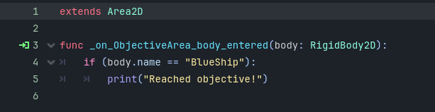
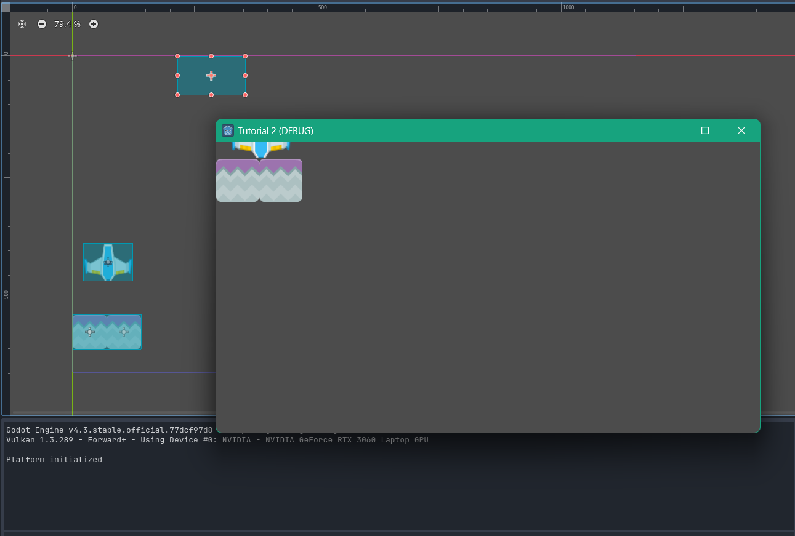

# Tutorial 2 Game Development

**Nama:** Yosua Chrial Martono \
**NPM:** 2106750686

### Latihan Playtest:

Sekarang coba gerakkan objek landasan ke atas sehingga objek pesawatnya hampir menyentuh batas atas area permainan/window. Kemudian jawablah pertanyaan-pertanyaan berikut:

1. Apa saja pesan log yang dicetak pada panel Ouput?

   - ada dua buah pesan log yang dicetak pada panel output yakni,
     - Platform Initialized, pada awal program
     - Reached Objective!, ketika blueship melewati batas atas dari viewport.

2. Coba gerakkan landasan ke batas area bawah, lalu gerakkan kembali ke atas hingga hampir menyentuh batas atas. Apa saja pesan log yang dicetak pada panel Output?

   - Reached Objective!, pesan ini hanya dicetak ketika blueship melewati batas atas.

3. Buka scene MainLevel dengan tampilan workspace 2D. Apakah lokasi scene ObjectiveArea memiliki kaitan dengan pesan log yang dicetak pada panel Output pada percobaan sebelumnya?
   - Ya, hal ini karena pesan "Reached Objective!" hanya akan diprint ketika ada sebuah object bernama "Blueship" yang memasuki area bodynya.
   - Hal ini dapat dilihat di file ObjectiveArea.gd
     
   - Teori ini juga bisa dibuktikan dengan mengubah posisi dari objective area sehingga ketika blueship naik ke batas atas Ia tidak akan mengenai objective area. Ketika hal ini terjadi tidak ada pesan log yang keluar di output.
     

### Latihan Memanipulasi Node dan Scene

1. Scene BlueShip dan StonePlatform sama-sama memiliki sebuah child node bertipe Sprite. Apa fungsi dari node bertipe Sprite?

   - Berdasarkan Godot Docs, Sprite adalah sebuah node yang **menampilkan sebuah texture**.
     - Dalam kasus ini karena yang digunakan adalah Sprite2D maka yang ditampilkan adalah 2D texture.
   - Berdasarkan dokumentasi, texture yang ditampilkan bisa berasal dari potongan sebuah texture atlas yang lebih besar atau sebuah frame dari suatu sprite sheet animation.
   - Singkat cerita node ini berfungsi untuk menampilkan texture yang akan digunakan untuk suatu node.

2. Root node dari scene BlueShip dan StonePlatform menggunakan tipe yang berbeda. BlueShip menggunakan tipe RigidBody2D, sedangkan StonePlatform menggunakan tipe StaticBody2D. Apa perbedaan dari masing-masing tipe node?

   - Berdasarkan dokumentasi dari godot sendiri, mereka berdua adalah child dari PhysicBody2D. Perbedaan mereka berada di bagaimana RigidBody2D dapat digerakan oleh **gaya eksternal** dari object lain sedangkan StaticBody2D tidak dapat.
   - Perbedaan terrefleksi pada usecase mereka masing-masing
     - RigidBody2D digunakan saat kita membutuhkan **physic-based movement** seperti player maupun objek yang bisa berinteraksi dengan player.
     - StaticBody2D digunakan saat kita membutuhkan sebuah **immovable object** seperti tembok dan lantai.

3. Ubah nilai atribut Mass pada tipe RigidBody2D secara bebas di scene BlueShip, lalu coba jalankan scene MainLevel. Apa yang terjadi?

   - Tidak ada hal yang terjadi karena atribut mass hanya akan memiliki efek **ketika kedua objek yang berinteraksi adalah RigidBody2D**, sementara pada kasus ini stone platform adalah StaticBody2D.
   - Ketika kedua objek yang berinteraksi adalah RigidBody2D maka efeknya akan terlihat dengan bagaimana objek dengan **mass yang lebih kecil akan lebih mengalami efek yang lebih besar**.

4. Ubah nilai atribut Disabled pada tipe CollisionShape2D di scene StonePlatform, lalu coba jalankan scene MainLevel. Apa yang terjadi?

   - Ketika atribut ini diubah maka CollisionShape2D pada StonePlatform akan dinonaktifkan, hal ini menyebabkan objek StonePlatform tidak bisa "ditabrak" oleh objek apapun.
   - Efeknya terlihat di bagaimana **Blueship langsung jatuh** ketika melewati StonePlatform ketimbang bagaimana behaviour sebelumnya terjadi.

5. Pada scene MainLevel, coba manipulasi atribut Position, Rotation, dan Scale milik node BlueShip secara bebas. Apa yang terjadi pada visualisasi BlueShip di Viewport?

   - Position, posisi BlueShip pada Viewport berubah dimana perubahan tervisualisasikan secara linear. Hal ini sesuai dengan bagaimana perubahan pada sumbu x akan menggeser objek ke kiri dan kanan serta perubahan pada sumbu y menggeser objek ke atas dan bawah.
   - Rotation, objek BlueShip mengalami rotasi terhadap origin point nya. Origin point disini berperan sebagai poros dari rotasi.
   - Scale, ukuran dari objek BlueShip mengalami perubahan sesuai perubahan pada scale. Namun, perubahan ini tidak terlihat pada mode play meskipun terlihat pada ViewPort.

6. Pada scene MainLevel, perhatikan nilai atribut Position node PlatformBlue, StonePlatform, dan StonePlatform2. Mengapa nilai Position node StonePlatform dan StonePlatform2 tidak sesuai dengan posisinya di dalam scene (menurut Inspector) namun visualisasinya berada di posisi yang tepat?
   - Hal ini karena posisi dari node StonePlatform dan StonePlatform2 ditetapkan **relatif terhadap parent node** mereka yakni PlatformBlue. Hal ini berarti bahwa posisi asli dari StonePlatform bukanlah 0,0 melainkan nilai dari posisi PlatformBlue ditambahkan dengan nilai StonePlatform. Hal ini terlihat juga dengan StonePlatform2 dimana posisinya memiliki nilai x yang lebih tinggi dibandingkan StonePlatform karena ia berada di kanan objek tersebut.
